# Playbook flows

A visual map of every playbook's actual process — the shape of what happens, not the detailed rules and anti-patterns behind each step (those are delivered on install; see the main [README](README.md)). Each diagram mirrors the real numbered process in that playbook, not a simplified stand-in.

## Core

### `core/engineering-loop.md`

Router + independent-verification rule — start every task here

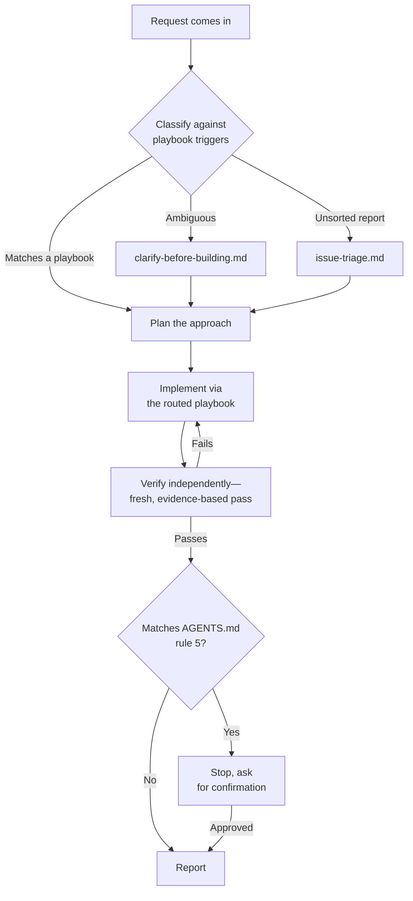

### `core/bug-fix.md`

Reproduce-before-fix workflow

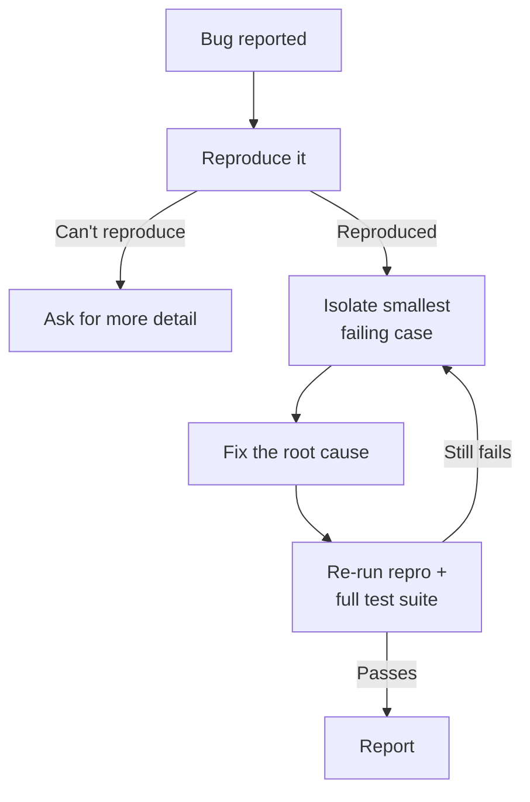

### `core/feature-development.md`

Test-first feature workflow

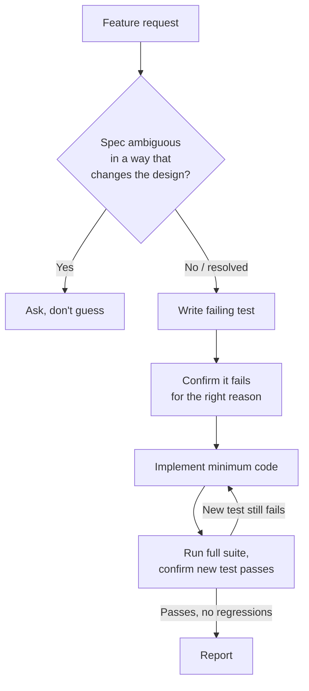

### `core/clarify-before-building.md`

Resolve a genuinely ambiguous request before implementation starts

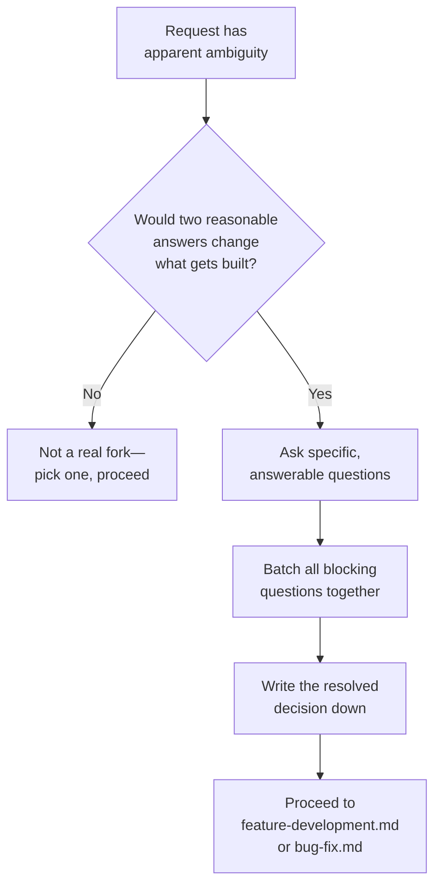

### `core/issue-triage.md`

Sort a new bug/enhancement report into a category and status

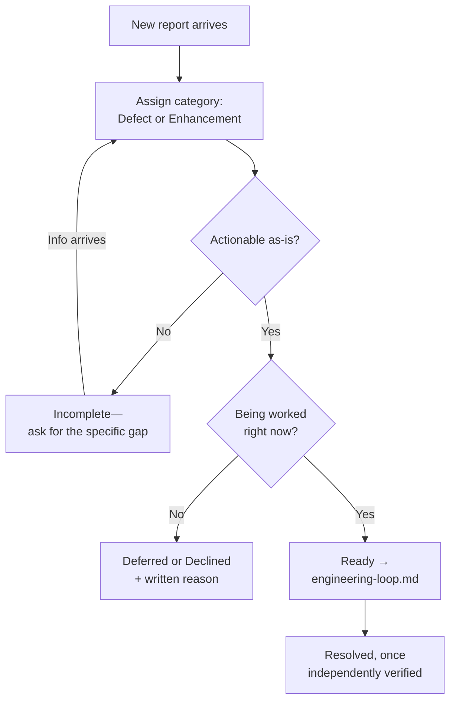


## Quality

### `quality/code-review.md`

Diff review checklist

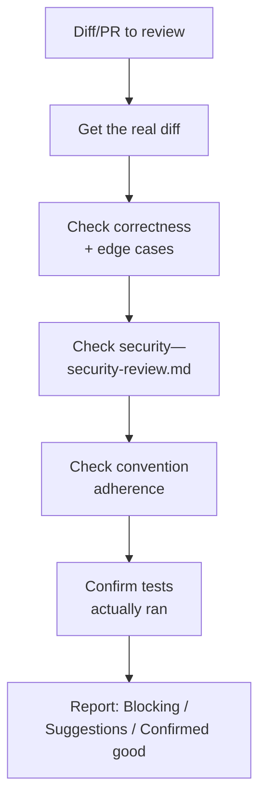

### `quality/security-review.md`

Language-agnostic security checklist

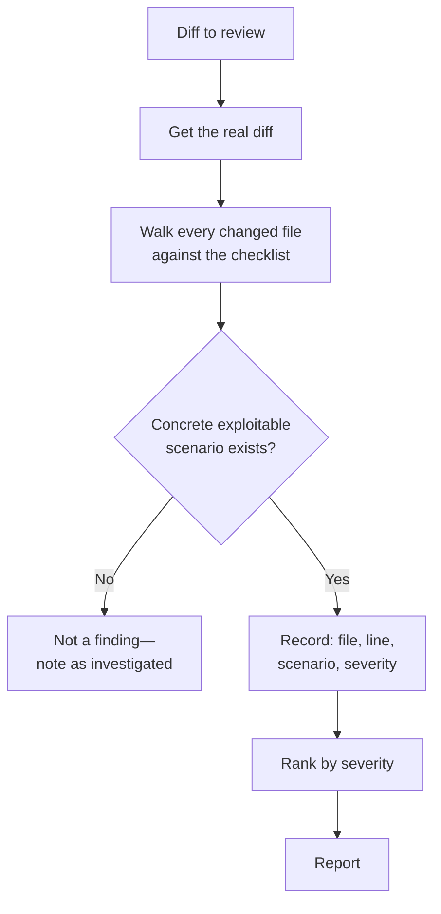

### `quality/architecture-review.md`

Design-level review: visibility, failure containment, access boundaries, operational control

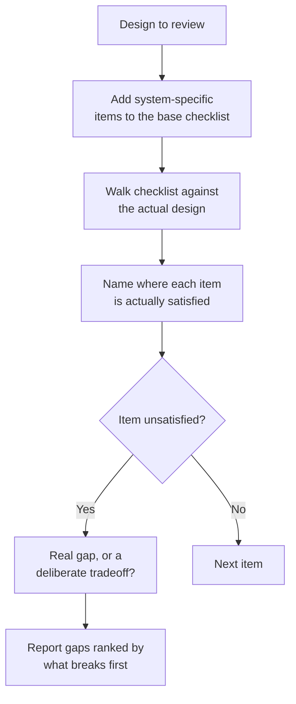

### `quality/frontend-testing.md`

Test layering for UI code

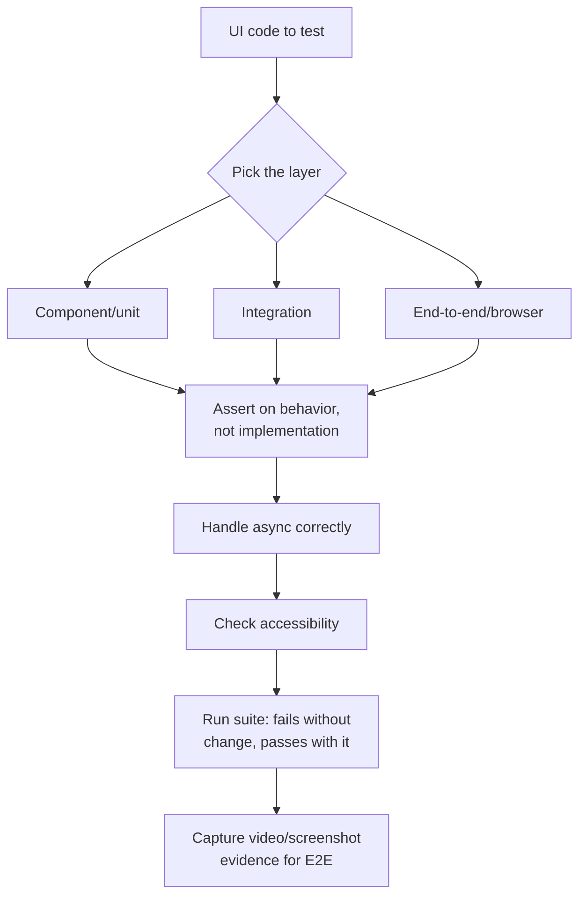

### `quality/backend-testing.md`

Test layering for server code

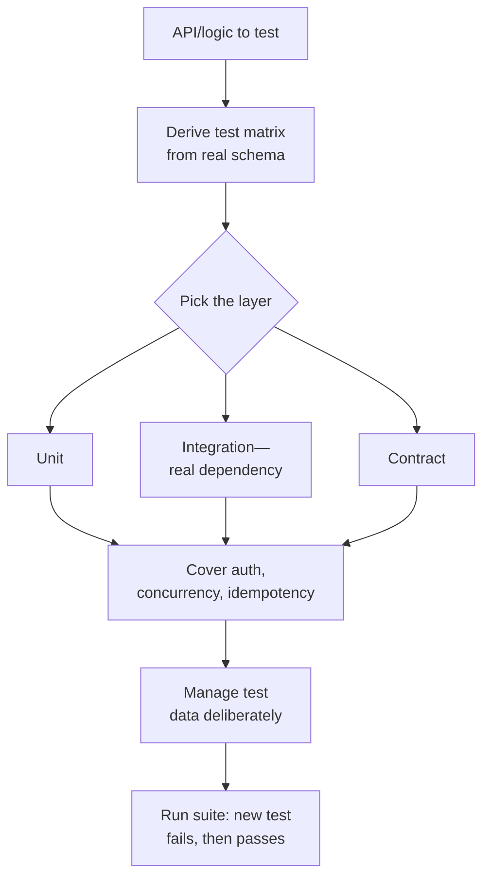

### `quality/docs-sync.md`

Verify doc claims against real code, run the project's real linter

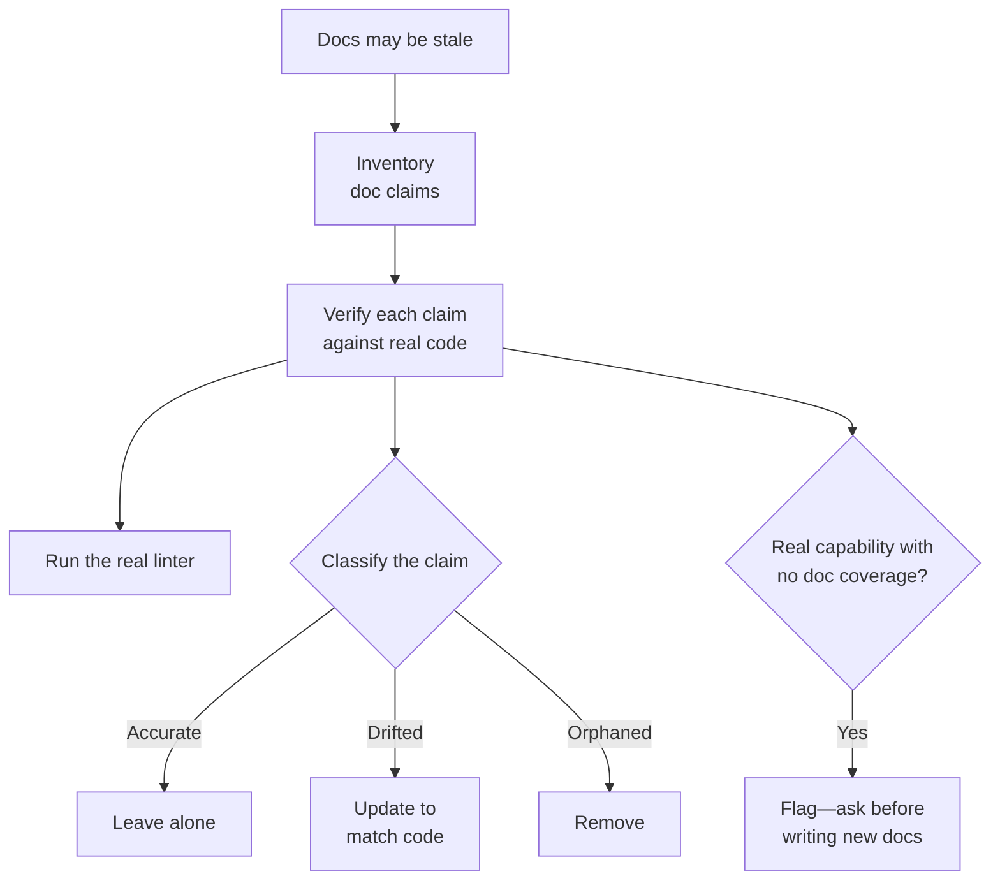

### `quality/observability.md`

Instrument a feature so its failures surface before a user reports them

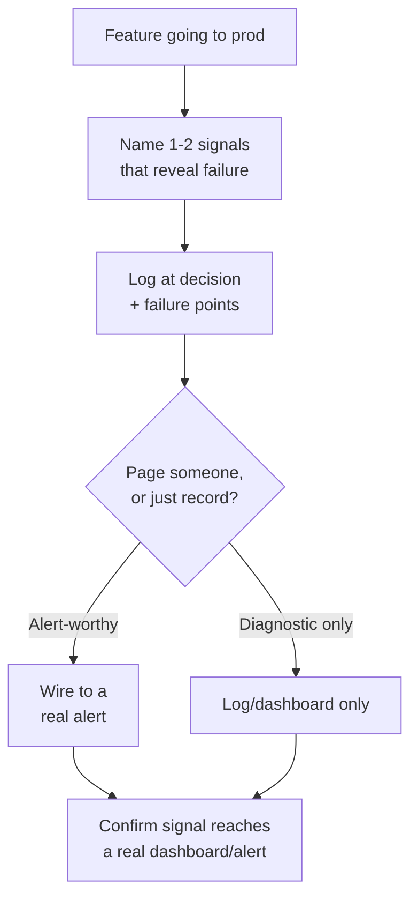


## Change types

### `change-types/refactoring.md`

Behavior-preserving restructuring

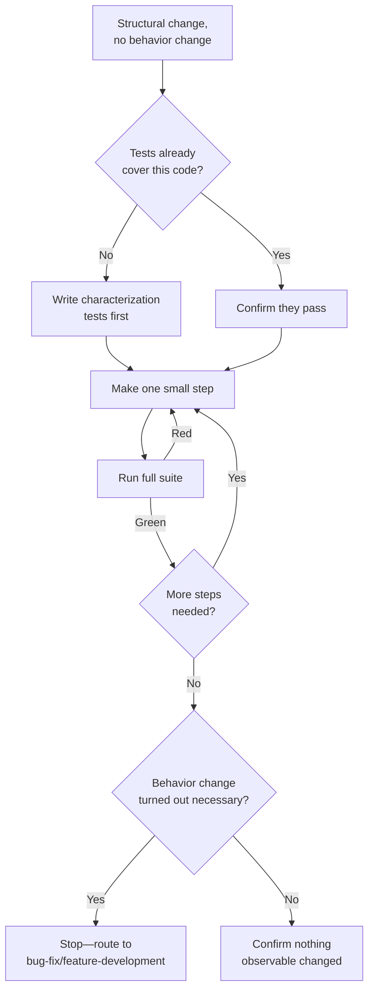

### `change-types/dependency-upgrades.md`

Bumping a dependency version safely

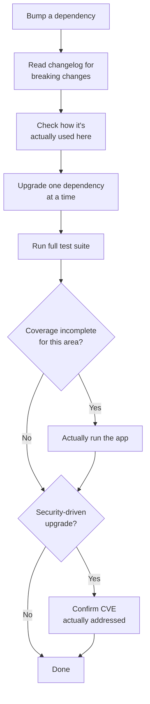

### `change-types/database-migration.md`

Safe schema changes via expand/migrate/contract

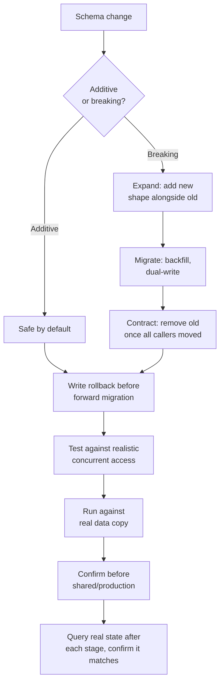

### `change-types/incident-response.md`

Restore service first, root-cause after

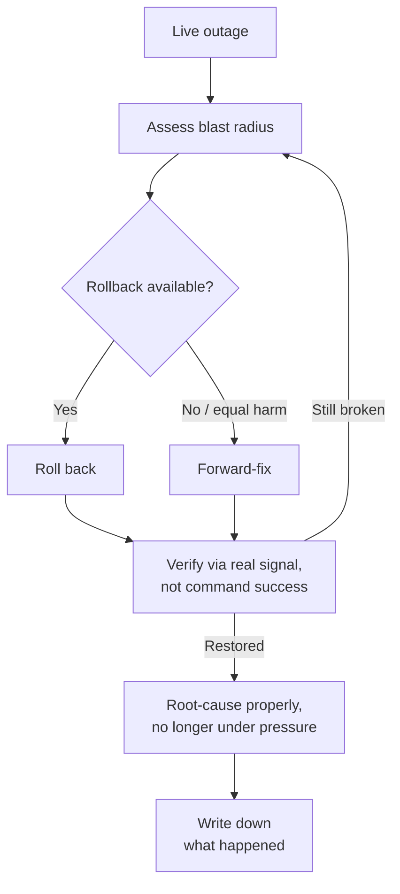

### `change-types/release.md`

Decide blast-radius limits and rollback path before a release starts

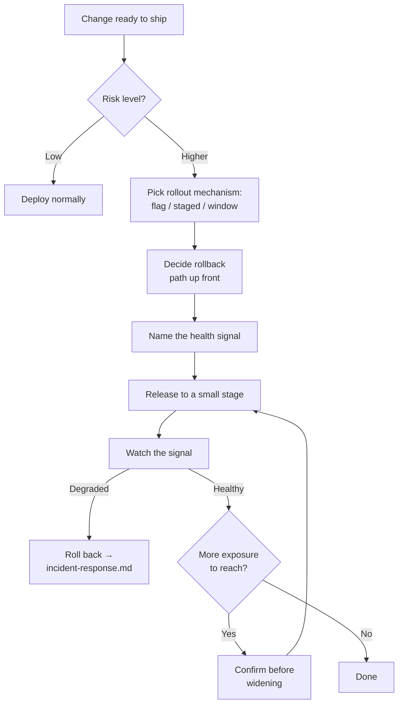

### `change-types/performance.md`

Profile before optimizing, measure the same way after

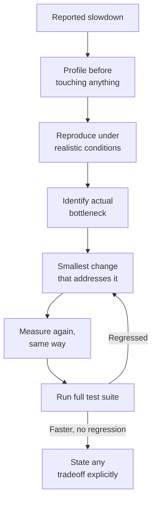


## Autonomy

### `autonomy/mission-mode.md`

Standing-objective autonomous operation, with an explicit autonomy dial

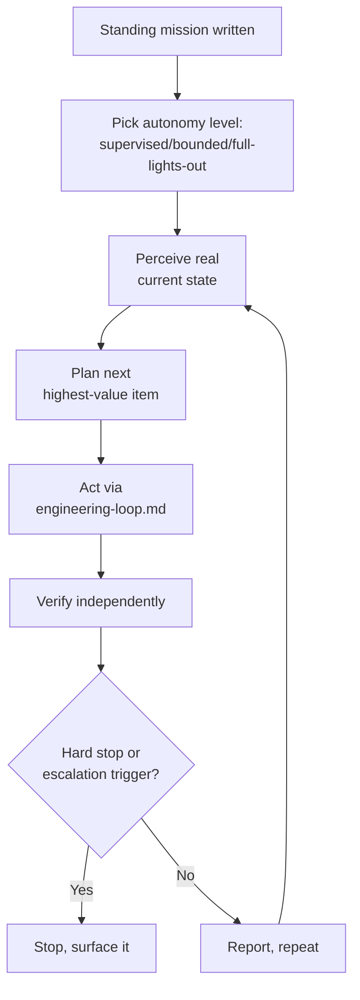

### `autonomy/roles.md`

Reusable personas, and when delegating to one is worth it

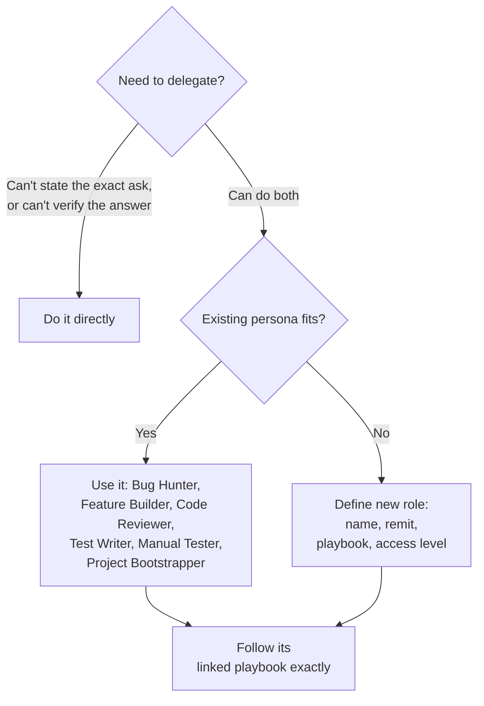

### `autonomy/standing-permission.md`

A written, bounded grant letting the agent skip per-action confirmation for explicitly named actions only

```mermaid
flowchart TD
    A[Human writes grant:\nactions + scope + duration] --> B[Agent hits an action]
    B --> C{Literally named\nin the grant?}
    C -->|No| D[Ungranted—\nnormal confirmation gate]
    C -->|Yes| E{On the permanent\nfloor list?}
    E -->|Yes—destructive/\nguardrail-blocked| D
    E -->|No| F[Proceed without asking]
    F --> G[Log action + which\ngrant line covered it]
    D --> H[Ask for confirmation]
```


## Safety

### `safety/safety-guardrail.md`

A real, enforced block on destructive shell commands

```mermaid
flowchart TD
    A[Command about to run] --> B[block-dangerous.sh checks\nagainst deny_patterns]
    B -->|Matches destructive pattern| C[Exit 2: blocked,\nreason on stderr]
    B -->|Safe| D[Exit 0: runs normally]
    C --> E[Hard block\nin the tool]
```

### `safety/memory-hygiene.md`

Don't trust a remembered fact once its source code has changed

```mermaid
flowchart TD
    A[Recalled memory\nabout code] --> B{References specific\ncode/file/symbol?}
    B -->|No—a preference\nor decision| C[Label as stated intent,\nnot a code fact]
    B -->|Yes| D[Re-check the\nsource it's about]
    D --> E{Still matches?}
    E -->|Yes| F[Treat as valid]
    E -->|No / gone| G[Treat as unverified—\nre-derive from current code]
```

### `safety/sensitive-data.md`

Classify data before deciding how strictly to handle it

```mermaid
flowchart TD
    A[Feature touches personal/\nsensitive data] --> B[Classify: direct /\nindirect / not sensitive]
    B -->|Unsure| C[Treat as more sensitive\nuntil confirmed]
    B --> D[Minimize what's\ncollected/stored]
    D --> E[Encrypt at rest\n+ in transit]
    E --> F[Keep out of logs,\nerrors, analytics]
    F --> G[Define retention\n+ deletion story]
    G --> H[Restrict access\nto minimum needed]
```


## Top level

### `project-bootstrap.md`

Onboard an agent to an unfamiliar repo, and wire the guardrail + personas into it

```mermaid
flowchart TD
    A[Unfamiliar repo] --> B[Detect real stack\nfrom actual files]
    B --> C[Write grounded AGENTS.md]
    C --> D{Tool supports\na hook mechanism?}
    D -->|Yes| E[Wire safety-guardrail.md]
    D -->|No| F[Say so explicitly—\ndon't fake it]
    E --> G{Tool supports\nsub-agents?}
    F --> G
    G -->|Yes| H[Install roles.md personas]
    G -->|No| I[Skip honestly]
    H --> J[Offer standing-permission\ngrant, don't assume one]
    I --> J
    J --> K[Verify: run test/lint,\ntest the guardrail]
    K --> L[Report summary]
```

### `codebase-mapping.md`

Document a codebase module by module from real dependency structure

```mermaid
flowchart TD
    A[Document a codebase] --> B[Find real module boundaries\nfrom the dependency graph]
    B --> C[Read each module's\ninterface + tests]
    C --> D[Write + verify\none doc per module]
    D --> E{Skill/agent\nrequested?}
    E -->|No| F[Done—docs are\nthe deliverable]
    E -->|Yes| G[Generate in tool's format,\ngrounded in verified doc]
    G --> H[Verify generated\nskill with a real question]
```

### `database-mapping.md`

Document a database table by table from the real schema and code usage

```mermaid
flowchart TD
    A[Document a database] --> B[Read real schema /\nmigration history]
    B --> C[Capture constraints\nper column]
    C --> D[Record relationships,\nenforced or not]
    D --> E[Cross-reference against\nreal code usage]
    E --> F{Name matches\nreal meaning?}
    F -->|No| G[Flag naming mismatch]
    F -->|Yes| H[Write + verify\ntable doc]
    G --> H
    H --> I{Skill/agent\nrequested?}
    I -->|Yes| J[Generate, grounded\nin verified doc]
    I -->|No| K[Done]
```

### `third-party-api-integration.md`

Analyze and test a third-party API for real, credentials never handled or logged

```mermaid
flowchart TD
    A[Integrate external API] --> B[Phase 1: read all docs\nin batches]
    B --> C[Extract endpoints,\nauth, response shapes]
    C --> D[Phase 2: name env var\nfor the credential]
    D --> E{Human pastes\nraw key anyway?}
    E -->|Yes| F[Treat as compromised,\nrequire rotation]
    E -->|No| G[Write script reading\nfrom env var, masked output]
    F --> G
    G --> H[Call real API,\ncompare vs docs]
    H --> I{Asked to link\nto the schema?}
    I -->|No| J[Done—tested\nand understood]
    I -->|Yes| K[Phase 3: map fields\nvs database-mapping.md]
    K --> L[Propose migration—\nnever apply directly]
```

### `project-audit.md`

Audit a whole project, then fix only what's explicitly approved

```mermaid
flowchart TD
    A[Audit a project] --> B[Run existing checklists\nat project scope]
    B --> C[Record findings:\nwhere, why, severity]
    C --> D[Report, ranked\nby impact]
    D --> E[Stop—wait for\nexplicit approval]
    E -->|Approved subset| F[Route each fix through\nengineering-loop.md]
    F --> G[Independently\nreverify each fix]
    G --> H[Report fixed /\ndeferred / open]
```

### `demo-video.md`

Generate a narrated screen-recording demo from a script

```mermaid
flowchart TD
    A[Write script:\nSAY/SHOW lines] --> B[Generate voice-over\nnarrate.sh]
    B --> C[Generate captions\ncaptions.sh]
    C --> D[Record screen\nrecord-screen.sh]
    D --> E[Assemble video + narration\n+ captions assemble.sh]
    E --> F[Watch it—confirm timing\nactually lines up]
```

