# Playbook flows

A visual map of every playbook's actual process — the shape of what happens, not the detailed rules and anti-patterns behind each step (those are delivered on install; see the main [README](README.md)). Each diagram mirrors the real numbered process in that playbook, not a simplified stand-in.

## Core

### `core/engineering-loop.md`

Router + independent-verification rule — start every task here

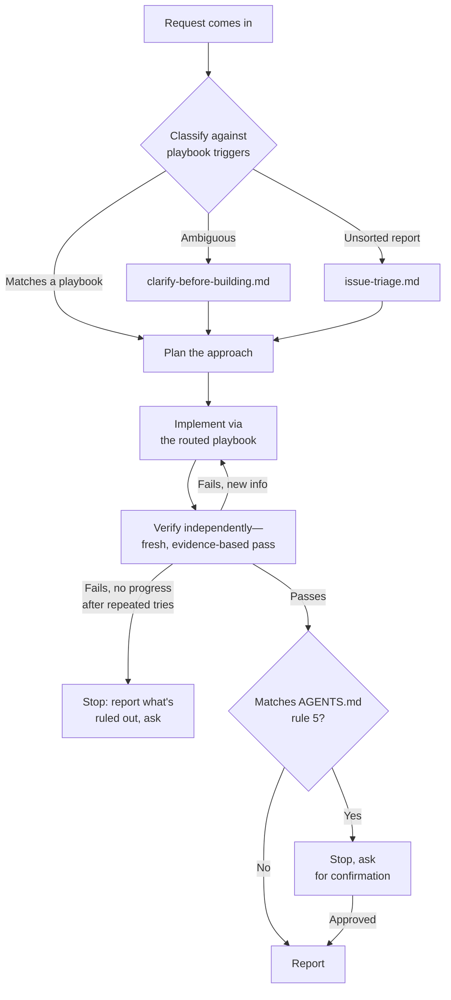
```mermaid
flowchart TD
    A[Request comes in] --> B{Classify against\nplaybook triggers}
    B -->|Ambiguous| C[clarify-before-building.md]
    B -->|Unsorted report| D[issue-triage.md]
    B -->|Matches a playbook| E[Plan the approach]
    C --> E
    D --> E
    E --> F[Implement via\nthe routed playbook]
    F --> G[Verify independently—\nfresh, evidence-based pass]
    G -->|Fails, new info| F
    G -->|Fails, no progress\nafter repeated tries| K[Stop: report what's\nruled out, ask]
    G -->|Passes| H{Matches AGENTS.md\nrule 5?}
    H -->|Yes| I[Stop, ask\nfor confirmation]
    H -->|No| J[Report]
    I -->|Approved| J
```

### `core/bug-fix.md`

Reproduce-before-fix workflow

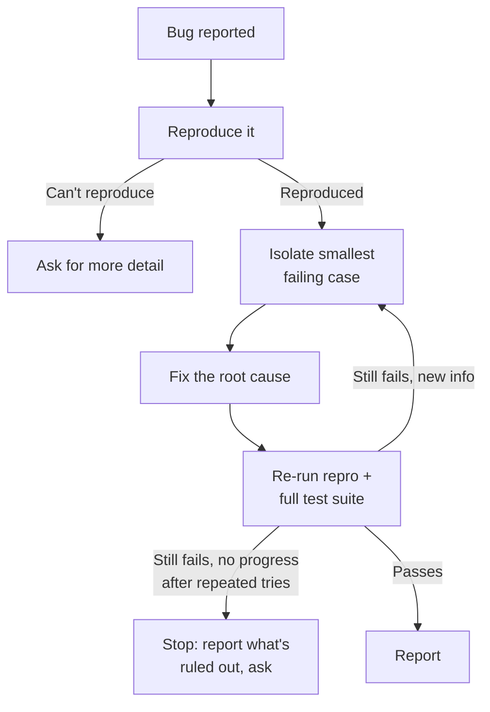
```mermaid
flowchart TD
    A[Bug reported] --> B[Reproduce it]
    B -->|Can't reproduce| C[Ask for more detail]
    B -->|Reproduced| D[Isolate smallest\nfailing case]
    D --> E[Fix the root cause]
    E --> F[Re-run repro +\nfull test suite]
    F -->|Still fails, new info| D
    F -->|Still fails, no progress\nafter repeated tries| H[Stop: report what's\nruled out, ask]
    F -->|Passes| G[Report]
```

### `core/feature-development.md`

Test-first feature workflow

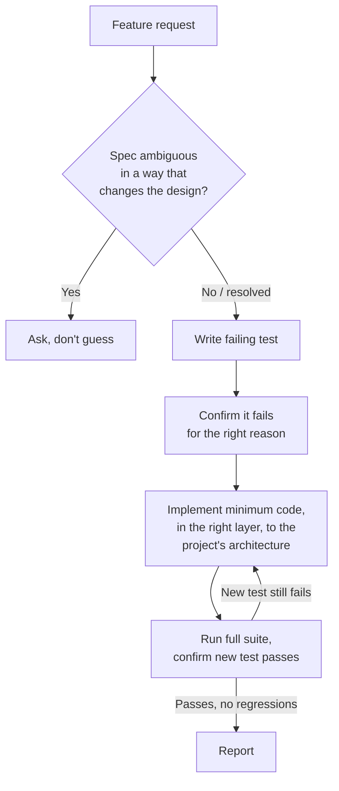
```mermaid
flowchart TD
    A[Feature request] --> B{Spec ambiguous\nin a way that\nchanges the design?}
    B -->|Yes| C[Ask, don't guess]
    B -->|No / resolved| D[Write failing test]
    D --> E[Confirm it fails\nfor the right reason]
    E --> F[Implement minimum code,\nin the right layer, to the\nproject's architecture]
    F --> G[Run full suite,\nconfirm new test passes]
    G -->|New test still fails| F
    G -->|Passes, no regressions| H[Report]
```

### `core/clarify-before-building.md`

Resolve a genuinely ambiguous request before implementation starts

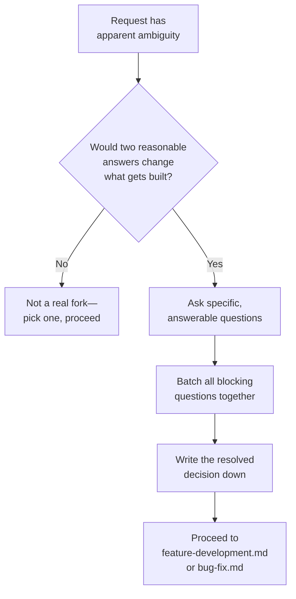
```mermaid
flowchart TD
    A[Request has\napparent ambiguity] --> B{Would two reasonable\nanswers change\nwhat gets built?}
    B -->|No| C[Not a real fork—\npick one, proceed]
    B -->|Yes| D[Ask specific,\nanswerable questions]
    D --> E[Batch all blocking\nquestions together]
    E --> F[Write the resolved\ndecision down]
    F --> G[Proceed to\nfeature-development.md\nor bug-fix.md]
```

### `core/issue-triage.md`

Sort a new bug/enhancement report into a category and status

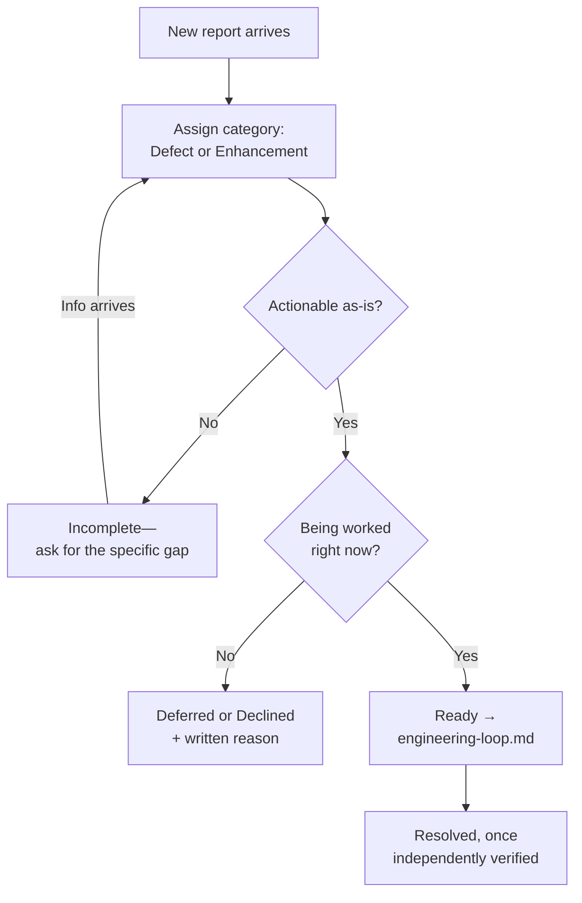
```mermaid
flowchart TD
    A[New report arrives] --> B[Assign category:\nDefect or Enhancement]
    B --> C{Actionable as-is?}
    C -->|No| D[Incomplete—\nask for the specific gap]
    C -->|Yes| E{Being worked\nright now?}
    E -->|No| F[Deferred or Declined\n+ written reason]
    E -->|Yes| G[Ready →\nengineering-loop.md]
    G --> H[Resolved, once\nindependently verified]
    D -->|Info arrives| B
```

### `core/finish-work.md`

Take finished work to "checked, documented, committed, pushed, in review", with a yes before each step that changes history or leaves the machine

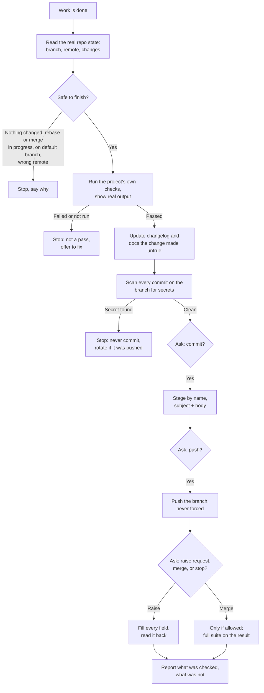
```mermaid
flowchart TD
    A[Work is done] --> B[Read the real repo state:\nbranch, remote, changes]
    B --> C{Safe to finish?}
    C -->|Nothing changed, rebase or merge\nin progress, on default branch,\nwrong remote| Z[Stop, say why]
    C -->|Yes| D[Run the project's own checks,\nshow real output]
    D -->|Failed or not run| Y[Stop: not a pass,\noffer to fix]
    D -->|Passed| E[Update changelog and\ndocs the change made untrue]
    E --> F[Scan every commit on the\nbranch for secrets]
    F -->|Secret found| X[Stop: never commit,\nrotate if it was pushed]
    F -->|Clean| G{Ask: commit?}
    G -->|Yes| H[Stage by name,\nsubject + body]
    H --> I{Ask: push?}
    I -->|Yes| J[Push the branch,\nnever forced]
    J --> K{Ask: raise request,\nmerge, or stop?}
    K -->|Raise| L[Fill every field,\nread it back]
    K -->|Merge| M[Only if allowed;\nfull suite on the result]
    L --> N[Report what was checked,\nwhat was not]
    M --> N
```

## Quality

### `quality/code-review.md`

Diff review checklist

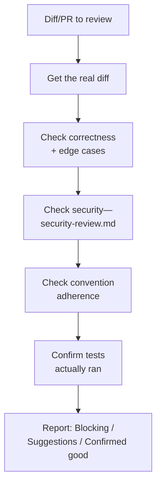
```mermaid
flowchart TD
    A[Diff/PR to review] --> B[Get the real diff]
    B --> C[Check correctness\n+ edge cases]
    C --> D[Check security—\nsecurity-review.md]
    D --> E[Check convention\nadherence]
    E --> F[Confirm tests\nactually ran]
    F --> G[Report: Blocking /\nSuggestions / Confirmed good]
```

### `quality/receiving-code-review.md`

How the person being reviewed responds

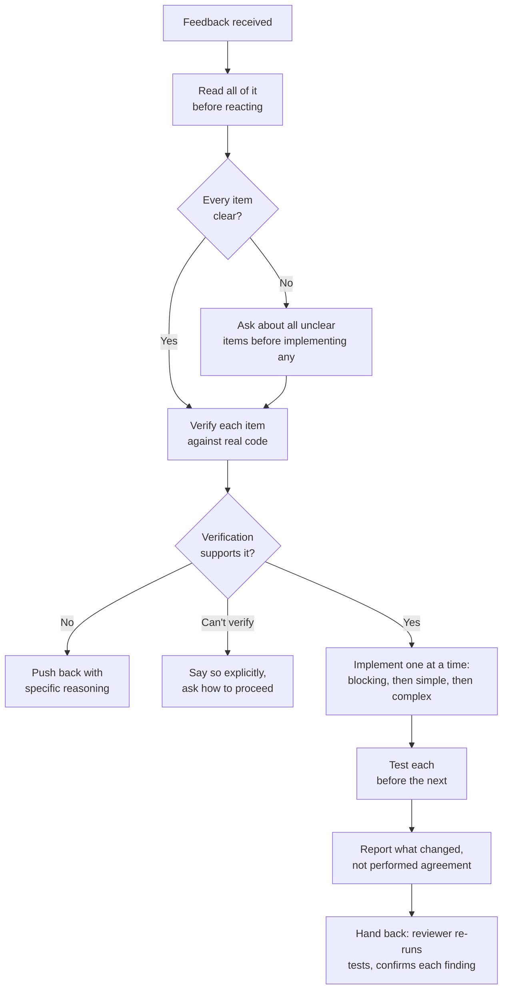
```mermaid
flowchart TD
    A[Feedback received] --> B[Read all of it\nbefore reacting]
    B --> C{Every item\nclear?}
    C -->|No| D[Ask about all unclear\nitems before implementing any]
    C -->|Yes| E[Verify each item\nagainst real code]
    D --> E
    E --> F{Verification\nsupports it?}
    F -->|No| G[Push back with\nspecific reasoning]
    F -->|Can't verify| H[Say so explicitly,\nask how to proceed]
    F -->|Yes| I[Implement one at a time:\nblocking, then simple, then complex]
    I --> J[Test each\nbefore the next]
    J --> K[Report what changed,\nnot performed agreement]
    K --> V[Hand back: reviewer re-runs\ntests, confirms each finding]
```

### `quality/security-review.md`

Language-agnostic security checklist

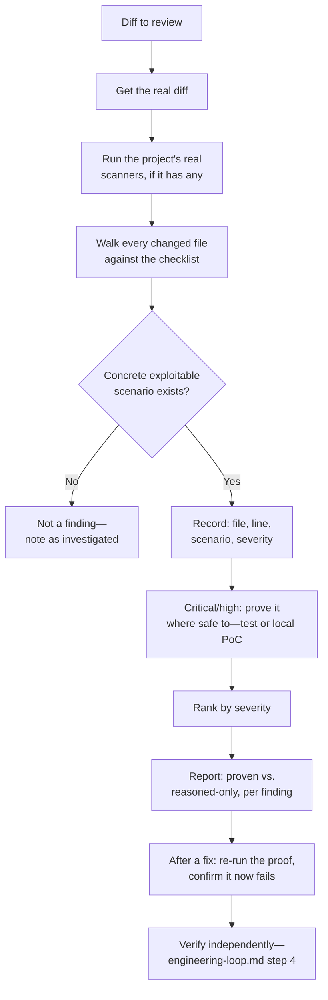
```mermaid
flowchart TD
    A[Diff to review] --> B[Get the real diff]
    B --> S[Run the project's real\nscanners, if it has any]
    S --> C[Walk every changed file\nagainst the checklist]
    C --> D{Concrete exploitable\nscenario exists?}
    D -->|No| E[Not a finding—\nnote as investigated]
    D -->|Yes| F[Record: file, line,\nscenario, severity]
    F --> P[Critical/high: prove it\nwhere safe to—test or local PoC]
    P --> G[Rank by severity]
    G --> H[Report: proven vs.\nreasoned-only, per finding]
    H --> V[After a fix: re-run the proof,\nconfirm it now fails]
    V --> I[Verify independently—\nengineering-loop.md step 4]
```

### `quality/architecture-review.md`

Design-level review: visibility, failure containment, access boundaries, operational control

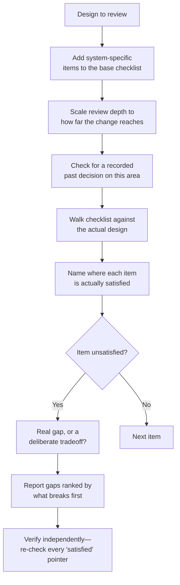
```mermaid
flowchart TD
    A[Design to review] --> B[Add system-specific\nitems to the base checklist]
    B --> R[Scale review depth to\nhow far the change reaches]
    R --> P[Check for a recorded\npast decision on this area]
    P --> C[Walk checklist against\nthe actual design]
    C --> D[Name where each item\nis actually satisfied]
    D --> E{Item unsatisfied?}
    E -->|Yes| F[Real gap, or a\ndeliberate tradeoff?]
    E -->|No| G[Next item]
    F --> H[Report gaps ranked by\nwhat breaks first]
    H --> V[Verify independently—\nre-check every 'satisfied' pointer]
```

### `quality/frontend-testing.md`

Test layering for UI code

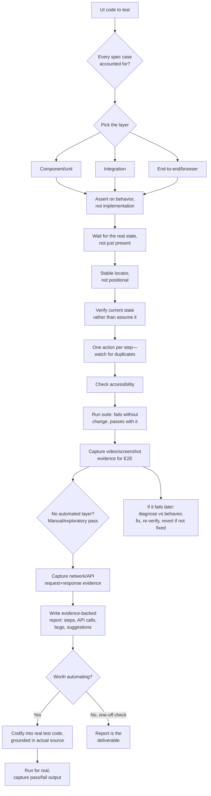
```mermaid
flowchart TD
    A[UI code to test] --> A2{Every spec case\naccounted for?}
    A2 --> B{Pick the layer}
    B --> C[Component/unit]
    B --> D[Integration]
    B --> E[End-to-end/browser]
    C --> F[Assert on behavior,\nnot implementation]
    D --> F
    E --> F
    F --> G[Wait for the real state,\nnot just present]
    G --> G2[Stable locator,\nnot positional]
    G2 --> G3[Verify current state\nrather than assume it]
    G3 --> G4[One action per step—\nwatch for duplicates]
    G4 --> H[Check accessibility]
    H --> I[Run suite: fails without\nchange, passes with it]
    I --> J[Capture video/screenshot\nevidence for E2E]
    J --> K{No automated layer?\nManual/exploratory pass}
    K --> L[Capture network/API\nrequest+response evidence]
    L --> M[Write evidence-backed\nreport: steps, API calls,\nbugs, suggestions]
    M --> N{Worth automating?}
    N -->|Yes| O[Codify into real test code,\ngrounded in actual source]
    N -->|No, one-off check| P[Report is the\ndeliverable]
    O --> Q[Run for real,\ncapture pass/fail output]
    J --> R[If it fails later:\ndiagnose vs behavior,\nfix, re-verify, revert if not fixed]
```

### `quality/backend-testing.md`

Test layering for server code

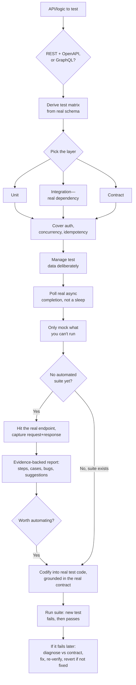
```mermaid
flowchart TD
    A[API/logic to test] --> A2{REST + OpenAPI,\nor GraphQL?}
    A2 --> B[Derive test matrix\nfrom real schema]
    B --> C{Pick the layer}
    C --> D[Unit]
    C --> E[Integration—\nreal dependency]
    C --> F[Contract]
    D --> G[Cover auth,\nconcurrency, idempotency]
    E --> G
    F --> G
    G --> H[Manage test\ndata deliberately]
    H --> H2[Poll real async\ncompletion, not a sleep]
    H2 --> H3[Only mock what\nyou can't run]
    H3 --> H4{No automated\nsuite yet?}
    H4 -->|Yes| H5[Hit the real endpoint,\ncapture request+response]
    H5 --> H6[Evidence-backed report:\nsteps, cases, bugs, suggestions]
    H6 --> H7{Worth automating?}
    H7 -->|Yes| H8[Codify into real test code,\ngrounded in the real contract]
    H4 -->|No, suite exists| H8
    H8 --> I[Run suite: new test\nfails, then passes]
    I --> J[If it fails later:\ndiagnose vs contract,\nfix, re-verify, revert if not fixed]
```

### `quality/exploratory-qa.md`

Given a URL with no other direction: discover journeys, then test them

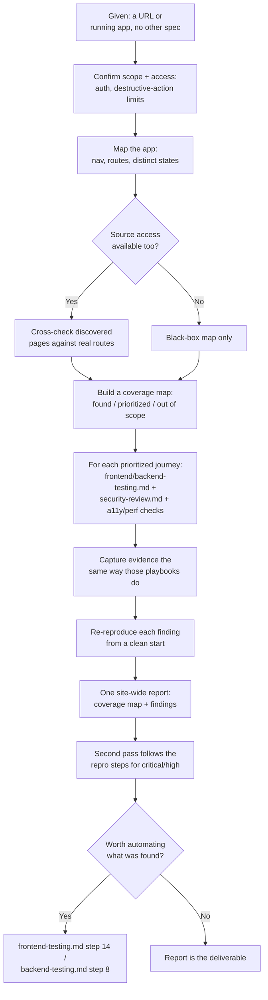
```mermaid
flowchart TD
    A[Given: a URL or\nrunning app, no other spec] --> B[Confirm scope + access:\nauth, destructive-action limits]
    B --> C[Map the app:\nnav, routes, distinct states]
    C --> D{Source access\navailable too?}
    D -->|Yes| E[Cross-check discovered\npages against real routes]
    D -->|No| F[Black-box map only]
    E --> G[Build a coverage map:\nfound / prioritized / out of scope]
    F --> G
    G --> H[For each prioritized journey:\nfrontend/backend-testing.md +\nsecurity-review.md + a11y/perf checks]
    H --> I[Capture evidence the\nsame way those playbooks do]
    I --> R[Re-reproduce each finding\nfrom a clean start]
    R --> J[One site-wide report:\ncoverage map + findings]
    J --> V[Second pass follows the\nrepro steps for critical/high]
    V --> K
    K{Worth automating\nwhat was found?}
    K -->|Yes| L[frontend-testing.md step 14 /\nbackend-testing.md step 8]
    K -->|No| M[Report is the deliverable]
```

### `quality/docs-sync.md`

Verify doc claims against real code, run the project's real linter

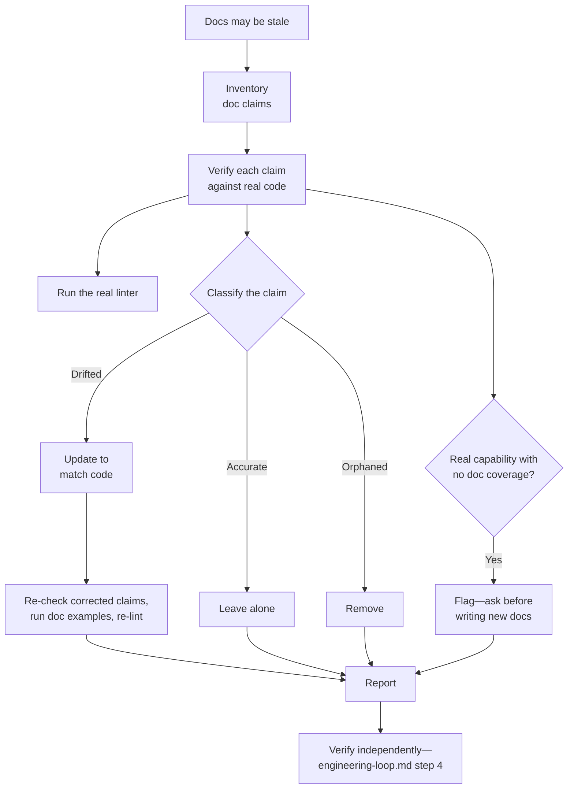
```mermaid
flowchart TD
    A[Docs may be stale] --> B[Inventory\ndoc claims]
    B --> C[Verify each claim\nagainst real code]
    C --> D[Run the real linter]
    C --> E{Classify the claim}
    E -->|Accurate| F[Leave alone]
    E -->|Drifted| G[Update to\nmatch code]
    E -->|Orphaned| H[Remove]
    C --> I{Real capability with\nno doc coverage?}
    I -->|Yes| J[Flag—ask before\nwriting new docs]
    G --> R[Re-check corrected claims,\nrun doc examples, re-lint]
    R --> S[Report]
    F --> S
    H --> S
    J --> S
    S --> V[Verify independently—\nengineering-loop.md step 4]
```

### `quality/observability.md`

Instrument a feature so its failures surface before a user reports them

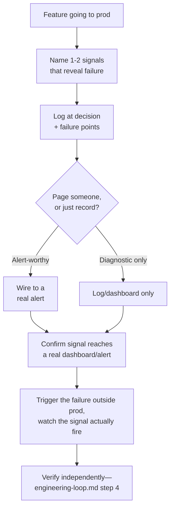
```mermaid
flowchart TD
    A[Feature going to prod] --> B[Name 1-2 signals\nthat reveal failure]
    B --> C[Log at decision\n+ failure points]
    C --> D{Page someone,\nor just record?}
    D -->|Alert-worthy| E[Wire to a\nreal alert]
    D -->|Diagnostic only| F[Log/dashboard only]
    E --> G[Confirm signal reaches\na real dashboard/alert]
    F --> G
    G --> T[Trigger the failure outside prod,\nwatch the signal actually fire]
    T --> V[Verify independently—\nengineering-loop.md step 4]
```

### `quality/writing-style.md`

Prose that reads like someone who understands the change

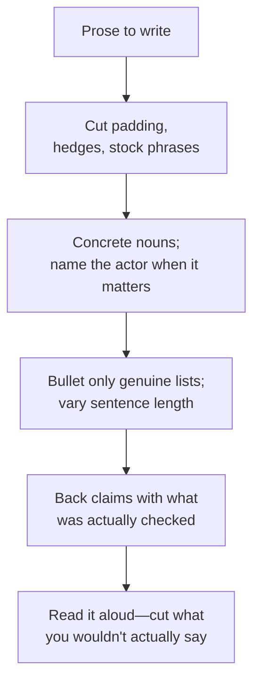
```mermaid
flowchart TD
    A[Prose to write] --> B[Cut padding,\nhedges, stock phrases]
    B --> C[Concrete nouns;\nname the actor when it matters]
    C --> D[Bullet only genuine lists;\nvary sentence length]
    D --> E[Back claims with what\nwas actually checked]
    E --> F[Read it aloud—cut what\nyou wouldn't actually say]
```

## Change types

### `change-types/refactoring.md`

Behavior-preserving restructuring

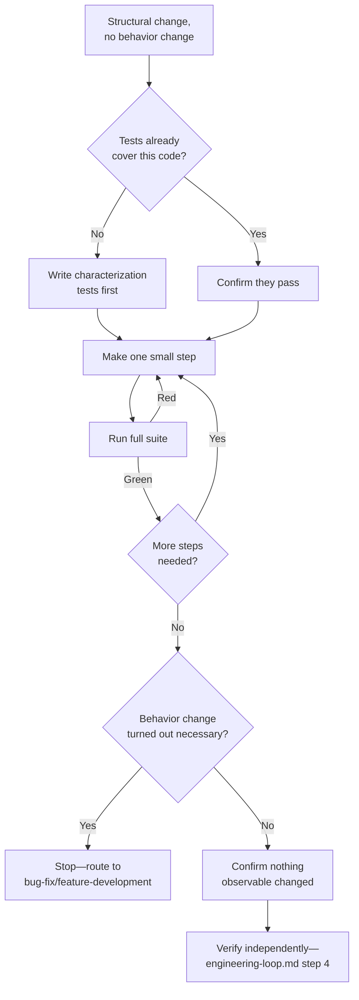
```mermaid
flowchart TD
    A[Structural change,\nno behavior change] --> B{Tests already\ncover this code?}
    B -->|No| C[Write characterization\ntests first]
    B -->|Yes| D[Confirm they pass]
    C --> E[Make one small step]
    D --> E
    E --> F[Run full suite]
    F -->|Red| E
    F -->|Green| G{More steps\nneeded?}
    G -->|Yes| E
    G -->|No| H{Behavior change\nturned out necessary?}
    H -->|Yes| I[Stop—route to\nbug-fix/feature-development]
    H -->|No| J[Confirm nothing\nobservable changed]
    J --> V[Verify independently—\nengineering-loop.md step 4]
```

### `change-types/dependency-upgrades.md`

Bumping a dependency version safely

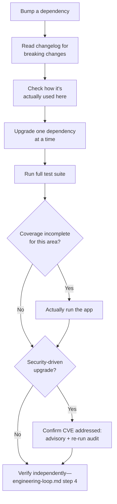
```mermaid
flowchart TD
    A[Bump a dependency] --> B[Read changelog for\nbreaking changes]
    B --> C[Check how it's\nactually used here]
    C --> D[Upgrade one dependency\nat a time]
    D --> E[Run full test suite]
    E --> F{Coverage incomplete\nfor this area?}
    F -->|Yes| G[Actually run the app]
    F -->|No| H{Security-driven\nupgrade?}
    G --> H
    H -->|Yes| I[Confirm CVE addressed:\nadvisory + re-run audit]
    H -->|No| J
    I --> J[Verify independently—\nengineering-loop.md step 4]
```

### `change-types/database-migration.md`

Safe schema changes via expand/migrate/contract

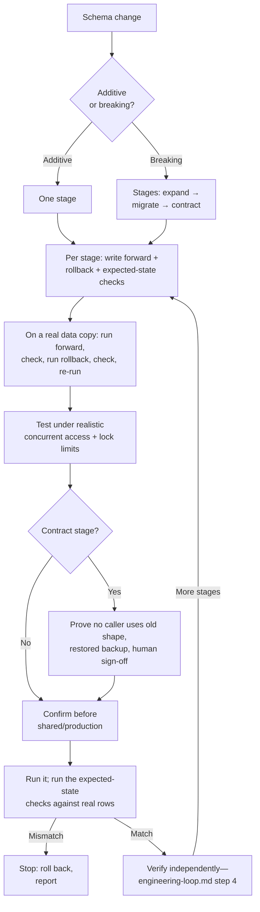
```mermaid
flowchart TD
    A[Schema change] --> B{Additive\nor breaking?}
    B -->|Additive| C[One stage]
    B -->|Breaking| D[Stages: expand →\nmigrate → contract]
    C --> G
    D --> G[Per stage: write forward +\nrollback + expected-state checks]
    G --> R[On a real data copy: run forward,\ncheck, run rollback, check, re-run]
    R --> H[Test under realistic\nconcurrent access + lock limits]
    H --> X{Contract stage?}
    X -->|Yes| Y[Prove no caller uses old shape,\nrestored backup, human sign-off]
    X -->|No| J
    Y --> J[Confirm before\nshared/production]
    J --> K[Run it; run the expected-state\nchecks against real rows]
    K -->|Mismatch| L[Stop: roll back,\nreport]
    K -->|Match| V[Verify independently—\nengineering-loop.md step 4]
    V -->|More stages| G
```

### `change-types/incident-response.md`

Restore service first, root-cause after

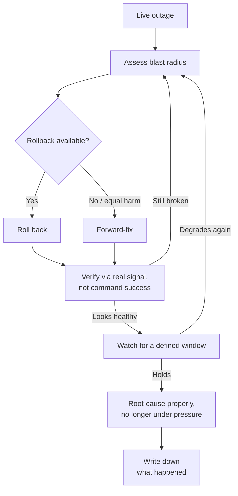
```mermaid
flowchart TD
    A[Live outage] --> B[Assess blast radius]
    B --> C{Rollback available?}
    C -->|Yes| D[Roll back]
    C -->|No / equal harm| E[Forward-fix]
    D --> F[Verify via real signal,\nnot command success]
    E --> F
    F -->|Still broken| B
    F -->|Looks healthy| W[Watch for a defined window]
    W -->|Degrades again| B
    W -->|Holds| G[Root-cause properly,\nno longer under pressure]
    G --> H[Write down\nwhat happened]
```

### `change-types/release.md`

Decide blast-radius limits and rollback path before a release starts

```mermaid
flowchart TD
    A[Change ready to ship] --> B{Risk level?}
    B -->|Low| C[Deploy normally]
    B -->|Higher| D[Pick rollout mechanism:\nflag / staged / window]
    D --> E[Decide rollback\npath up front]
    E --> E2[Exercise the rollback\npath once, outside prod]
    E2 --> F[Name health signal +\ndegraded threshold]
    F --> G[Release to a small stage]
    G --> H[Watch the signal]
    H -->|Degraded| I[Roll back →\nincident-response.md]
    H -->|Healthy| J{More exposure\nto reach?}
    J -->|Yes| K[Confirm before\nwidening]
    K --> G
    J -->|No| L[Confirm live version + signal\nfrom the source, not the tool]
    L --> V[Verify independently—\nengineering-loop.md step 4]
```

### `change-types/performance.md`

Profile before optimizing, measure the same way after

```mermaid
flowchart TD
    A[Reported slowdown] --> B[Profile before\ntouching anything]
    B --> C[Reproduce under\nrealistic conditions]
    C --> D[Identify actual\nbottleneck]
    D --> E[Smallest change\nthat addresses it]
    E --> F[Measure again,\nsame way]
    F --> G[Run full test suite]
    G -->|Regressed| E
    G -->|Faster, no regression| H[State any\ntradeoff explicitly]
    H --> V[Independent re-measure,\nsame conditions]
```

## Autonomy

### `autonomy/mission-mode.md`

Standing-objective autonomous operation, with an explicit autonomy dial

```mermaid
flowchart TD
    A[Standing mission written] --> B[Pick autonomy level:\nsupervised/bounded/full-lights-out]
    B --> C[Perceive real\ncurrent state]
    C --> D[Plan next\nhighest-value item]
    D --> E[Act via\nengineering-loop.md]
    E --> F[Verify independently]
    F --> G{Hard stop or\nescalation trigger?}
    G -->|Yes| H[Stop, surface it]
    G -->|No| I[Report, repeat]
    I --> C
```

### `autonomy/roles.md`

Reusable personas, and when delegating to one is worth it

```mermaid
flowchart TD
    A{Need to delegate?} -->|Can't state the exact ask,\nor can't verify the answer| B[Do it directly]
    A -->|Can do both| C{Existing persona fits?}
    C -->|Yes| D[Use it: Bug Hunter,\nFeature Builder, Code Reviewer,\nTest Writer, Manual Tester,\nProject Bootstrapper]
    C -->|No| E[Define new role: name, remit,\nplaybook, access, model tier,\nhow its work gets checked]
    E --> T[Trial on tasks with\nknown answers]
    T -->|Wrong or invented findings| E
    T -->|Matches| F
    D --> F[Follow its\nlinked playbook exactly]
    F --> V[Output carries evidence;\nchecked per engineering-loop.md step 4]
```

**Claude Code only — which model a generated persona uses:**

```mermaid
flowchart TD
    A[Generating a persona's\nsub-agent at install] --> B{Persona-specific env var set?\nAGENT_PLAYBOOKS_MODEL_-PERSONA-}
    B -->|Yes| C[Use that model—\nwins over everything below]
    B -->|No| D{Persona tagged\nverify or implement?}
    D -->|verify: Code Reviewer,\nManual/Exploratory Tester,\nBug Hunter| E{AGENT_PLAYBOOKS_MODEL_VERIFY set?}
    D -->|implement: Feature Builder,\nTest Writer, Project Bootstrapper| F{AGENT_PLAYBOOKS_MODEL_IMPLEMENT set?}
    E -->|Yes| C
    E -->|No| G[Default: opus]
    F -->|Yes| C
    F -->|No| H[Default: sonnet]
```

### `autonomy/standing-permission.md`

A written, bounded grant letting the agent skip per-action confirmation for explicitly named actions only

```mermaid
flowchart TD
    A[Human writes grant:\nactions + scope + duration] --> B[Agent hits an action]
    B --> C{Literally named\nin the grant?}
    C -->|No| D[Ungranted—\nnormal confirmation gate]
    C -->|Yes| E{On the permanent\nfloor list?}
    E -->|Yes—destructive/\nguardrail-blocked| D
    E -->|No| F[Proceed without asking]
    F --> G[Log action + which\ngrant line covered it]
    D --> H[Ask for confirmation]
```

## Safety

### `safety/safety-guardrail.md`

A real, enforced block on destructive shell commands

```mermaid
flowchart TD
    A[Command about to run] --> B[block-dangerous.sh checks\nagainst deny_patterns]
    B -->|Matches destructive pattern| C[Exit 2: blocked,\nreason on stderr]
    B -->|Safe| D[Exit 0: runs normally]
    C --> E[Hard block\nin the tool]
```

### `safety/secret-scan.md`

A real, enforced block on committing real secrets/credentials

```mermaid
flowchart TD
    A[Content about to be\nwritten or committed] --> B[detect-secrets.sh checks\nagainst known token formats]
    B -->|Matches a known secret format| C[Exit 2: blocked,\nreason on stderr]
    B -->|Clean| D[Exit 0: proceeds normally]
    C --> E[Hard block:\ncommit rejected or\nwrite refused]
```

### `safety/config-protection.md`

A real, enforced block on editing an existing linter/formatter config to
make a failing check pass instead of fixing the code

```mermaid
flowchart TD
    A[File about to be\nwritten, or staged for commit] --> B[block-config-edit.sh checks\nbasename against protected_files]
    B -->|Not a protected name| D[Exit 0: proceeds normally]
    B -->|Protected name| C{Already existed\nbefore this change?}
    C -->|No -- first-time creation| D
    C -->|Yes| E[Exit 2: blocked,\nreason on stderr]
    E --> F1[Claude Code:\nhard block pre-write]
    E --> F2[git pre-commit:\ncommit rejected]
```

### `safety/memory-hygiene.md`

Don't trust a remembered fact once its source code has changed

```mermaid
flowchart TD
    A[Recalled memory\nabout code] --> B{References specific\ncode/file/symbol?}
    B -->|No—a preference\nor decision| C[Label as stated intent,\nnot a code fact]
    B -->|Yes| D[Re-check the\nsource it's about]
    D --> E{Still matches?}
    E -->|Yes| F[Treat as valid]
    E -->|No / gone| G[Treat as unverified—\nre-derive from current code]
```

### `safety/sensitive-data.md`

Classify data before deciding how strictly to handle it

```mermaid
flowchart TD
    A[Feature touches personal/\nsensitive data] --> B[Classify: direct /\nindirect / not sensitive]
    B -->|Unsure| C[Treat as more sensitive\nuntil confirmed]
    C --> D
    B --> D[Minimize what's\ncollected/stored]
    D --> E[Encrypt at rest\n+ in transit]
    E --> F[Keep out of logs,\nerrors, analytics]
    F --> G[Define retention\n+ deletion story]
    G --> H[Restrict access\nto minimum needed]
    H --> T[Verify on the running system:\nsearch logs, run a deletion,\nread encryption, try access]
    T --> V[Verify independently—\nengineering-loop.md step 4]
```

## Top level

### `project/project-bootstrap.md`

Onboard an agent to an unfamiliar repo, and wire the guardrail + personas into it

```mermaid
flowchart TD
    A[Unfamiliar repo] --> B[Detect real stack\nfrom actual files]
    B --> C[Write grounded AGENTS.md]
    C --> C2[Install secret-scan.md +\nconfig-protection.md's\ngit pre-commit hooks]
    C2 --> D{Tool supports\na hook mechanism?}
    D -->|Yes| E[Wire safety-guardrail.md\n+ secret-scan.md\n+ config-protection.md\nPreToolUse hooks]
    D -->|No| F[Say so explicitly—\ndon't fake it]
    E --> G{Tool supports\nsub-agents?}
    F --> G
    G -->|Yes| H[Install roles.md personas]
    G -->|No| I[Skip honestly]
    H --> J[Offer standing-permission\ngrant, don't assume one]
    I --> J
    J --> K[Verify: run test/lint,\ntest the guardrail]
    K --> L[Report summary]
```

### `mapping/codebase-mapping.md`

Document a codebase module by module from real dependency structure

```mermaid
flowchart TD
    A[Document a codebase] --> B[Find real module boundaries—\nreal dep tool first, not by hand]
    B --> S{Doc from a prior\npass already exists?}
    S -->|Yes| S2[Cheap check: git log\nsince recorded commit—\nmodule path + its deps' paths]
    S2 -->|Nothing changed| F
    S2 -->|Real changes| C
    S -->|No| C[Read module's\ninterface + tests]
    C --> D[Write + verify doc,\nrecord commit verified against]
    D --> M[Mention skill/agent\ngeneration as available]
    M --> E{Human wants\nit generated?}
    E -->|No| F[Done—docs are\nthe deliverable]
    E -->|Yes| G[Generate in tool's format,\ngrounded in verified doc]
    G --> H[Verify generated\nskill with a real question]
```

### `mapping/database-mapping.md`

Document a database table by table from the real schema and code usage

```mermaid
flowchart TD
    A[Document a database] --> S{Doc from a prior\npass already exists?}
    S -->|Yes| S2[Cheap check: migration\nhistory since recorded point]
    S2 -->|Nothing changed| K2[Reuse doc as-is]
    S2 -->|Real changes| B
    S -->|No| B[Read real schema /\nmigration history]
    B --> C[Capture constraints\nper column]
    C --> D[Record relationships,\nenforced or not]
    D --> E[Cross-reference against\nreal code usage]
    E --> E2{Meaning still\nambiguous?}
    E2 -->|Yes| E3[Sample real\nstored values]
    E2 -->|No| F
    E3 --> F{Name matches\nreal meaning?}
    F -->|No| G[Flag naming mismatch]
    F -->|Yes| H[Write + verify\ntable doc]
    G --> H
    H --> M[Mention skill/agent\ngeneration as available]
    M --> I{Human wants\nit generated?}
    I -->|Yes| J[Generate, grounded\nin verified doc]
    I -->|No| K[Done]
```

### `mapping/third-party-api-integration.md`

Analyze and test a third-party API for real, credentials never handled or logged

```mermaid
flowchart TD
    A[Integrate external API] --> Z{Docs gated behind\nan unknown login/auth wall?}
    Z -->|Yes| Z2[Inspect the real gate's\nHTML/response first]
    Z -->|No| Y
    Z2 --> Y{Given source is a\ncatalog of many interfaces?}
    Y -->|Yes| Y2[Surface full scope,\nlet human decide coverage]
    Y -->|No| B
    Y2 --> B[Phase 1: read the\ndocs in batches]
    B --> C[Extract endpoints,\nauth, response shapes]
    C --> D[Phase 2: name env vars\nfor the real credentials]
    D --> E{Human pastes\nraw key/password anyway?}
    E -->|Yes| F[Treat as compromised,\nrequire rotation]
    E -->|No| G[Write script reading\nfrom env vars, masked output]
    F --> G
    G --> S[Sort ALL endpoints:\nread-only vs side-effecting]
    S --> S1[Batch-test every\nread-only endpoint,\nno per-endpoint ask]
    S --> S2[Ask ONCE about the whole\nside-effecting set]
    S2 -->|Confirmed subset| S3[Test only\nthat subset]
    S1 --> H
    S3 --> H
    H[Call real API,\ncompare vs docs] --> H2[Write ONE consolidated doc\nfor everything tested]
    H2 --> H2b[Offer OpenAPI/Postman export—\nsame verified-vs-doc distinction]
    H2b --> H3[Offer Phase 3—\nask, don't assume]
    H3 --> I{Human wants\nschema linking?}
    I -->|No| J[Done—tested,\ndocumented, understood]
    I -->|Yes| K[Phase 3: map fields\nvs database-mapping.md]
    K --> L[Propose migration—\nnever apply directly]
```

### `project/project-audit.md`

Audit a whole project, then fix only what's explicitly approved

```mermaid
flowchart TD
    A[Audit a project] --> B[Run existing checklists\nat project scope]
    B --> C[Record findings:\nwhere, why, severity]
    C --> D[Report, ranked\nby impact]
    D --> E[Stop—wait for\nexplicit approval]
    E -->|Approved subset| F[Route each fix through\nengineering-loop.md]
    F --> G[Independently\nreverify each fix]
    G --> H[Report fixed /\ndeferred / open]
```

### `media/demo-video.md`

Generate a narrated screen-recording demo from a script

```mermaid
flowchart TD
    A[Write script:\nSAY/SHOW lines] --> B[Generate voice-over\nnarrate.sh]
    B --> C[Generate captions\ncaptions.sh]
    C --> D[Record screen\nrecord-screen.sh]
    D --> E[Assemble video + narration\n+ captions assemble.sh]
    E --> F[Watch it—confirm timing\nactually lines up]
```

### `media/video-review.md`

Turn an existing recording into a verified report, then optionally route it into the engineering loop

```mermaid
flowchart TD
    A[Video or audio file] --> B[Extract audio + frames\nextract-media.sh]
    B --> C[Transcribe audio\ntranscribe.sh]
    C --> D[Read transcript + frames\ndirectly]
    D --> E[Draft findings:\nsummary, key points,\nbugs/gaps, asks]
    E --> F[Re-verify each finding\nagainst the actual evidence]
    F --> G[Report to user,\nevidence cited inline]
    G --> H{Codebase present\nand user wants to act?}
    H -->|Yes, one ask at a time| I[Hand off to\ncore/engineering-loop.md]
    H -->|No| J[Done — findings\nare the deliverable]
```

### `media/doc-review.md`

Turn a document into a verified report, then optionally route it into the engineering loop

```mermaid
flowchart TD
    A[Document: PDF/DOCX/etc] --> B[Extract text\nextract-doc-text.sh]
    B --> C{Text came back\nsparse? scanned/image PDF}
    C -->|Yes| D[Render pages as images\nrender-doc-pages.sh]
    C -->|No| E[Read text in\nbounded chunks]
    D --> E
    E --> F[Draft findings:\nsummary, key points,\nqueries raised, action items]
    F --> G[Re-verify each finding\nagainst the actual evidence]
    G --> H[Report to user,\nevidence cited inline]
    H --> I{Codebase present\nand user wants to act?}
    I -->|Yes, one item at a time| J[Hand off to\ncore/engineering-loop.md]
    I -->|No| K[Done — findings\nare the deliverable]
```

