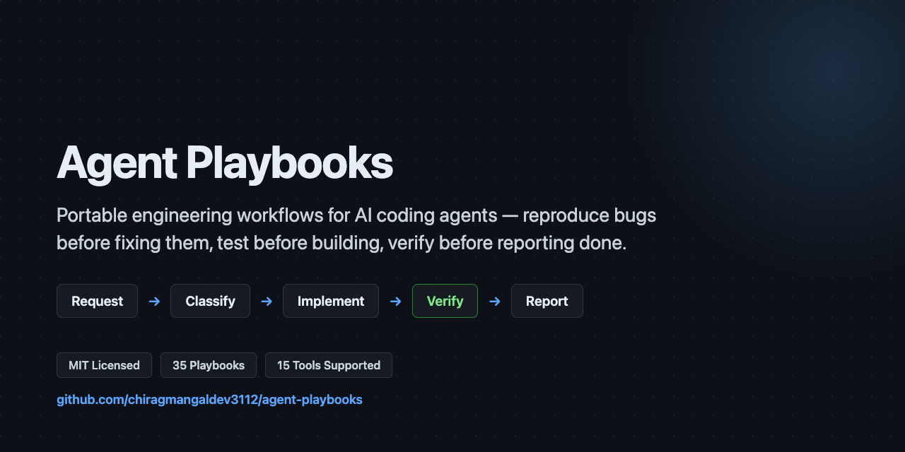

<p align="center">
  <a href="https://chiragmangaldev3112.github.io/agent-playbooks/">
    
  </a>
</p>

<p align="center">
  <a href="https://github.com/chiragmangaldev3112/agent-playbooks/actions/workflows/ci.yml"></a>
  <a href="https://github.com/chiragmangaldev3112/agent-playbooks/releases"></a>
  <a href="LICENSE"></a>
  <a href="https://github.com/chiragmangaldev3112/agent-playbooks/issues"></a>
  <a href="https://github.com/chiragmangaldev3112/agent-playbooks/stargazers"></a>
  <br>
  
  
  
</p>

<h1 align="center">🤖 Agent Playbooks</h1>

<p align="center"><strong>Portable engineering workflows for AI coding agents.</strong></p>

<p align="center">
  Give your agent a repeatable process — reproduce a bug before fixing it,
  write a test before building a feature, verify a change independently,
  refuse a destructive command outright — instead of letting it guess its
  way through each task.
</p>

<p align="center">
  🧠 One instruction set, every tool &nbsp;•&nbsp;
  🔁 Independent verification, always &nbsp;•&nbsp;
  🛡️ Destructive commands hard-blocked &nbsp;•&nbsp;
  🔐 Cryptographically signed releases
</p>

<p align="center">
  
  
  
  
  
  
</p>

```bash
curl -fsSL https://raw.githubusercontent.com/chiragmangaldev3112/agent-playbooks/main/install.sh -o install.sh
chmod +x install.sh
./install.sh .
```

💬 Then ask your agent: *"Fix this bug — reproduce it first, write a
regression test, implement the fix, and verify the result."*

**[▶ Watch the 7.5-minute demo](https://chiragmangaldev3112.github.io/agent-playbooks/demo.html)** — every one of the 36 playbooks, narrated, with a real terminal run each. Not a slideshow.

---

## 🗺️ Table of contents

- [🤔 Why This Exists](#why)
- [✨ What You Get, at a Glance](#what-you-get-at-a-glance)
- [🚀 Quick Start / Install](#install)
  - [🔐 Verifying a Release](#verifying-a-release)
  - [🔌 Wiring Into Your AI Tool](#wiring-into-your-ai-tool)
- [🔁 Day to Day: How You'll Actually Use This](#day-to-day-how-youll-actually-use-this)
- [🧰 Playbook Catalog](#playbook-catalog)
- [🧑‍🚀 Creating Your Own Bot (a Custom Persona)](#creating-your-own-bot-a-custom-persona-with-a-demo)
- [📡 How This Is Distributed](#how-this-is-distributed)
- [🔢 Two Different Version Numbers](#two-different-version-numbers)
- [🤝 Contributing and Security](#contributing-and-security)
- [📄 License](#license)

---

<a id="why"></a>
## 🤔 Why This Exists

Two separate problems, both real:

1. **Every tool wants its own file.** Different AI coding tools each
   expect instructions in their own format and location. This project has
   one generic instruction set instead, so you write the rules once and
   point every tool at the same source of truth.
2. **An agent left to its own judgment fails in the same few ways, every
   time.** It guesses at an ambiguous spec instead of asking. It grades its
   own work instead of checking it independently. It forgets a project's
   own conventions the moment a new session starts. It occasionally runs
   something destructive because nothing stopped it.

This is that process, written down once, usable everywhere — and every
playbook in it has been run against a real, throwaway test case at least
once, not just written and published.

**The difference, side by side:**

| ❌ Without Agent Playbooks | ✅ With Agent Playbooks |
|---|---|
| Agent guesses at an ambiguous spec | Asks before building |
| Agent grades its own work | Independent verification, always |
| Different instructions per AI tool | One file, every tool reads the same source |
| A destructive command runs because nothing stopped it | Hard-blocked automatically, before it executes |
| Project conventions forgotten every new session | Written down once, loaded every session |

<a id="what-you-get-at-a-glance"></a>
## ✨ What You Get, at a Glance

Full catalog with every file: [🧰 Playbook Catalog](#playbook-catalog).

| Category | Examples |
|---|---|
| **Core** | reproduce-before-fix bug workflow, test-first feature development, ambiguity resolution |
| **Quality** | code review, security review, architecture review, frontend/backend testing, cold-start exploratory QA |
| **Change types** | refactoring, dependency upgrades, database migration, incident response, release |
| **Safety** | enforced destructive-command block, enforced secret-commit block |
| **Autonomy** | standing-mission mode, reusable personas (Bug Hunter, Code Reviewer, ...) |
| **Project & mapping** | repo onboarding, codebase/database mapping, third-party API integration |

<a id="install"></a>
## 🚀 Quick Start / Install

```bash
curl -fsSL https://raw.githubusercontent.com/chiragmangaldev3112/agent-playbooks/main/install.sh -o install.sh
chmod +x install.sh
./install.sh /path/to/your/project   # or no path, for the current directory
```

> [!TIP]
> Takes under a minute. No account, no signup, no config file to hand-write.

Needs a shell that can run bash — macOS and Linux have this natively.
**On Windows**, run it via WSL or Git Bash, not a plain Command
Prompt/PowerShell session.

By default you get the current latest release. To install a specific past
version instead — see **[CHANGELOG.md](CHANGELOG.md)** for the full list
and what changed in each:

```bash
./install.sh --version 1.3.0 /path/to/your/project
# or: AGENT_PLAYBOOKS_VERSION=1.3.0 ./install.sh /path/to/your/project
```

**Installing just one playbook instead of the full set:**

```bash
./install.sh --only bug-fix /path/to/your/project
./install.sh --only bug-fix,code-review /path/to/your/project   # comma-separated, more than one
```

A bare name (with or without `.md`) is matched by filename anywhere under
`agent-playbooks/`; give a path relative to `agent-playbooks/` instead
(`core/bug-fix.md`) if two playbooks ever share a basename. Prints
exactly what was requested versus what was pulled in as a dependency, so
it's never a silent surprise.

<details>
<summary>🔎 How single-playbook installs handle dependencies (click to expand)</summary>

<br>

This still fetches the full release from the server — there's no
partial-fetch API — but only writes the requested file(s) to disk, plus,
automatically, whatever they actually need: a playbook's own direct
references to another playbook (one hop only — `core/engineering-loop.md`
links to nearly every other playbook by design, so following
references-of-references would pull in almost the whole set, defeating
the point) and any script reference, followed fully (a script is a real
functional need, not a "see also" pointer — requesting
`safety-guardrail.md` correctly pulls in `scripts/block-dangerous.sh`).
`AGENTS.md`, `VERSION`, and `LICENSE` are always included.

</details>

This copies `AGENTS.md` and `agent-playbooks/` into your project — fast, no
setup, no account, no token — and prints the version it installed. It also
drops in a one-line `CLAUDE.md` (only if you don't already have one) that
just imports `AGENTS.md`, because Claude Code only auto-loads `CLAUDE.md`,
never `AGENTS.md`.

<a id="verifying-a-release"></a>
### 🔐 Verifying a Release

The installer fetches content from a backend on every run (see
[📡 How This Is Distributed](#how-this-is-distributed)) — and because that
content becomes literal instructions for an AI agent with shell access, a
compromised or spoofed backend serving different content than intended is
a real threat model, not a hypothetical one.

> [!IMPORTANT]
> `install.sh` cryptographically verifies every release **before writing
> a single file to your project.** If verification fails, nothing gets
> written — there is no "install anyway" flag.

Here's exactly how:

1. **Every release is signed** with an Ed25519 key that lives only on the
   maintainer's machine — never deployed anywhere, never in this repo,
   never in the backend. `install.sh` embeds the fixed public half and
   verifies the signature with `ssh-keygen -Y verify` (not OpenSSL —
   stock macOS ships LibreSSL, which cannot verify Ed25519 signatures at
   all).
2. **The signed manifest lists a sha256 for every file** in the release.
   `install.sh` re-hashes each fetched file and compares — a valid
   signature over a manifest that doesn't match what was actually served
   is caught here too.
3. **Either check failing aborts the install** with a clear error and
   writes nothing to your project.

You don't need to do anything for this — it runs on every install. To
check it yourself: the public key is the `ALLOWED_SIGNERS` line near the
top of `install.sh`, and the verification logic is the block right before
any file gets copied into your project.

<details>
<summary>🔎 What changed vs. before, and why it matters (click to expand)</summary>

<br>

Before, HTTPS proved the connection to the check-in endpoint was
authentic, but not that the *content* it returned was what the maintainer
published — a compromised backend could have served anything and every
install would have accepted it silently. Now the backend is no longer in
the trust path for content integrity; it can withhold a release (see
`blocked`/`blocked_message` in `schema.sql`) but it can't successfully
substitute one, because it never holds the private signing key.

</details>

<a id="wiring-into-your-ai-tool"></a>
### 🔌 Wiring Into Your AI Tool

If you run it at a real terminal, it also asks which AI tool you're
using and generates real native artifacts for it — not just a copy of
the same text everywhere:

| Tool | What gets generated | Why |
|---|---|---|
| **Claude Code** | `.claude/skills/*/SKILL.md` (one per playbook, invocable via `/name`) + `.claude/agents/*.md` (the 6 personas) | Discoverable/invocable, not just background text |
| **Cursor** | `.cursor/rules/*.mdc` (Agent Requested mode) | Explicit `@name` mention, on top of the `AGENTS.md` it already reads natively |
| **Antigravity** | `.agents/skills/*/SKILL.md` | Its own docs never confirm it reads `AGENTS.md` automatically, unlike Cursor/Codex CLI — so this is the reliable path, not an assumption |
| **Codex CLI** | nothing extra | Reads `AGENTS.md` at the root natively — confirmed, this is the tool the convention originated from |
| **GitHub Copilot** | one `.github/copilot-instructions.md` pointer | Copilot has no semantic per-file matching, so one blanket file beats 30 always-on ones |
| **Anything else / skip** | nothing extra | Falls back to `AGENTS.md` alone — paste it into your tool's context manually if it doesn't read project files |

Every generated file is a **thin pointer** back to the real playbook in
`agent-playbooks/` — never a content copy — so nothing drifts out of sync
between the two if playbooks get updated later. Skip the prompt (or pipe
input, or set `AGENT_PLAYBOOKS_TOOL=none`) and you just get `AGENTS.md` +
`CLAUDE.md`, same as before.

**Installing for a specific tool without the interactive prompt** (e.g. in
CI, or if you already know which one you want):

```bash
AGENT_PLAYBOOKS_TOOL=claude      ./install.sh /path/to/your/project   # Claude Code
AGENT_PLAYBOOKS_TOOL=cursor      ./install.sh /path/to/your/project   # Cursor
AGENT_PLAYBOOKS_TOOL=antigravity ./install.sh /path/to/your/project   # Antigravity
AGENT_PLAYBOOKS_TOOL=codex       ./install.sh /path/to/your/project   # Codex CLI (nothing extra generated)
AGENT_PLAYBOOKS_TOOL=copilot     ./install.sh /path/to/your/project   # GitHub Copilot
AGENT_PLAYBOOKS_TOOL=none        ./install.sh /path/to/your/project   # AGENTS.md + CLAUDE.md only
```

The table above is only the tools this installer generates real artifacts
for. `agent-playbooks/README.md` — installed with every copy — documents
how to wire `AGENTS.md` itself into 15 tools total, including GitHub
Copilot CLI, OpenAI Codex's cloud/IDE surface, Gemini CLI, Devin CLI,
Factory Droid, Grok Build, Kimi Code, OpenCode, Pi, and Hermes Agent —
most of them read `AGENTS.md` automatically with no generation step
needed at all; check that file for the exact mechanism per tool. It also
covers how you actually *invoke* a playbook once it's wired in: most
tools match one by relevance automatically from plain language, no
command needed, but several also support asking for one directly by
name (`/bug-fix` in Claude Code and Hermes Agent, `@bug-fix` in Cursor
and Antigravity, `/skill:bug-fix` in Pi) when you already know which
one you want.

<details>
<summary>⚙️ <strong>Claude Code only</strong> — choosing which model each generated sub-agent uses (click to expand)</summary>

<br>

By default, the six personas in `.claude/agents/*.md` (see
`autonomy/roles.md`) are split by what they actually do — a role that
*checks* someone else's work (Code Reviewer, Manual/Exploratory Tester,
and Bug Hunter — it also fixes, but it's also the persona named for
independently re-running a repro to confirm someone else's fix, so it
takes the stricter tier) gets the strongest model, a role that only
*does* work a check will independently catch mistakes in (Feature
Builder, Test Writer, Project Bootstrapper) gets a lighter/faster one.
Override any of that — one persona, one whole tier, or "just use one
model for everything":

```bash
# Everything on the strongest model
AGENT_PLAYBOOKS_TOOL=claude AGENT_PLAYBOOKS_MODEL_VERIFY=opus AGENT_PLAYBOOKS_MODEL_IMPLEMENT=opus \
  ./install.sh /path/to/your/project

# Everything on the lightest/fastest model
AGENT_PLAYBOOKS_TOOL=claude AGENT_PLAYBOOKS_MODEL_VERIFY=haiku AGENT_PLAYBOOKS_MODEL_IMPLEMENT=haiku \
  ./install.sh /path/to/your/project

# Just the default tiering, but pin one persona differently
AGENT_PLAYBOOKS_TOOL=claude AGENT_PLAYBOOKS_MODEL_CODE_REVIEWER=haiku \
  ./install.sh /path/to/your/project

# Leave it alone entirely -- the sane opus(verify)/sonnet(implement) default
AGENT_PLAYBOOKS_TOOL=claude ./install.sh /path/to/your/project
```

Cursor, Antigravity, Codex CLI, and Copilot have no equivalent
per-sub-agent model setting to wire this into today, so these variables
are silently no-ops for them — not a broken promise, there's just nothing
on their side to point it at yet.

</details>

Then open your AI coding tool in that project and ask it to follow
`agent-playbooks/project/project-bootstrap.md` once — the smart, context-aware pass
that grounds `AGENTS.md` in your project's real stack and wires the safety
guardrail + personas into whichever tool you're using there.

From then on, every actual task routes through
`agent-playbooks/core/engineering-loop.md` — it classifies the request
(bug, feature, review, test...) and sends it to the matching playbook.

<a id="day-to-day-how-youll-actually-use-this"></a>
## 🔁 Day to Day: How You'll Actually Use This

There's no command to learn and no skill name to memorize. You describe
what you want the way you already do, and the router
(`core/engineering-loop.md`) sends it to the matching playbook on its
own:

| You say | What actually happens |
|---|---|
| "Fix this bug where..." | Reproduces the failure first, fixes, re-confirms — never a fix based on a guess |
| "Add a feature that..." | Writes a failing test from the spec before any implementation code |
| "Review this PR" | Reviews the real diff, checks security separately, tells you what's confirmed vs. only assumed |
| "This endpoint is slow" | Profiles before touching anything, instead of guessing at "the slow part" |
| "Ship this to production" | Decides a staged rollout and rollback plan first, checks in before widening exposure |
| "This feature stores user data" | Classifies what's sensitive before deciding how to handle it, keeps it out of logs |
| "Document this codebase / database" | Maps real module or table boundaries from actual code/schema, not folder or column names |
| "Integrate with X's API" | Tests the real API behavior for real, never handles your credential directly |
| "Here's a URL, find what's wrong with it" (no flow/spec named) | Maps the app's real pages/journeys first, prioritizes, then tests each one — instead of guessing which flow you meant |
| "Here's a recording of the bug" (any video/audio file) | Extracts audio + frames, transcribes locally, re-verifies every finding against that evidence, then routes each one through the engineering loop if you want it fixed |
| "Here's the spec/report" (PDF, Word doc, any format) | Extracts the text (and page images if it's scanned), reads a 600-page document the same way as a 6-page one via bounded chunks, re-verifies every finding, then routes each action item through the engineering loop if you want it acted on |
| 🚫 Anything destructive (force-push, dropping a table) | Hard-blocked, not just discouraged |

That's the whole interface. You don't need to read all 36 files before
getting value from any one of them — the router finds the right one, and
each file is self-contained if you ever want to read the one that just
fired.

<a id="playbook-catalog"></a>
## 🧰 Playbook Catalog

This describes what each playbook does — the actual instruction text is
delivered on install, not shown here. For a visual map of every
playbook's actual process, see **[FLOWS.md](FLOWS.md)** — a flowchart per
playbook, matching its real numbered steps. For a concrete "here's what
you'd say, here's what happens" example for every single one, see
**[EXAMPLES.md](EXAMPLES.md)**. For what changed in each released version
(and to install an older one on purpose), see
**[CHANGELOG.md](CHANGELOG.md)**.

<details open>
<summary>🎯 <strong>Core</strong> — start every task here</summary>

<br>

| Playbook | What it's for |
|---|---|
| `core/engineering-loop.md` | Router + independent-verification rule — start every task here |
| `core/bug-fix.md` | Reproduce-before-fix workflow |
| `core/feature-development.md` | Test-first feature workflow |
| `core/clarify-before-building.md` | Resolve a genuinely ambiguous request before implementation starts |
| `core/issue-triage.md` | Sort a new bug/enhancement report into a category and status |

</details>

<details>
<summary>✅ <strong>Quality</strong> — reviews and testing</summary>

<br>

| Playbook | What it's for |
|---|---|
| `quality/code-review.md` | Diff review checklist |
| `quality/receiving-code-review.md` | How the person being reviewed responds — verify feedback against the codebase before implementing it, resolve every unclear item first |
| `quality/security-review.md` | Language-agnostic security checklist |
| `quality/architecture-review.md` | Design-level review: visibility, failure containment, access boundaries, operational control |
| `quality/frontend-testing.md` / `quality/backend-testing.md` | Test layering for UI and server code, usable by testers or developers |
| `quality/exploratory-qa.md` | Given a URL with no other direction: map the app's real journeys first, then test each one |
| `quality/docs-sync.md` | Verify doc claims against real code, run the project's real linter |
| `quality/observability.md` | Instrument a feature so its failures surface before a user reports them |
| `quality/writing-style.md` | Commit messages, PR descriptions, and reports that read like someone who understands the change; links to [github.com/blader/humanizer](https://github.com/blader/humanizer) for a deeper catalog of the same patterns, as an optional follow-up, not a dependency |

</details>

<details>
<summary>🔄 <strong>Change types</strong> — refactors, upgrades, migrations, releases</summary>

<br>

| Playbook | What it's for |
|---|---|
| `change-types/refactoring.md` | Behavior-preserving restructuring |
| `change-types/dependency-upgrades.md` | Bumping a dependency version safely |
| `change-types/database-migration.md` | Safe schema changes via expand/migrate/contract |
| `change-types/incident-response.md` | Restore service first, root-cause after |
| `change-types/release.md` | Decide blast-radius limits and rollback path before a release starts |
| `change-types/performance.md` | Profile before optimizing, measure the same way after |

</details>

<details>
<summary>🛡️ <strong>Safety</strong> — real, enforced guardrails</summary>

<br>

| Playbook | What it's for |
|---|---|
| `safety/safety-guardrail.md` | A real, enforced block on destructive shell commands |
| `safety/secret-scan.md` | A real, enforced block on committing real secrets/credentials |
| `safety/memory-hygiene.md` | Don't trust a remembered fact once its source code has changed |
| `safety/sensitive-data.md` | Classify data before deciding how strictly to handle it |

</details>

<details>
<summary>🤖 <strong>Autonomy</strong> — personas and standing permission</summary>

<br>

| Playbook | What it's for |
|---|---|
| `autonomy/mission-mode.md` | Standing-objective autonomous operation, with an explicit autonomy dial |
| `autonomy/roles.md` | Reusable personas (Bug Hunter, Feature Builder, Code Reviewer, Test Writer, Manual/Exploratory Tester, Project Bootstrapper) |
| `autonomy/standing-permission.md` | A written, bounded grant letting the agent skip per-action confirmation for explicitly named actions only |

</details>

<details>
<summary>🗺️ <strong>Project & mapping</strong> — onboarding, codebase/database/API mapping</summary>

<br>

| Playbook | What it's for |
|---|---|
| `project/project-bootstrap.md` | Onboard an agent to an unfamiliar repo, and wire the guardrail + personas into it |
| `project/project-audit.md` | Audit a whole project against the existing quality checklists, then fix only what's explicitly approved, with every fix independently reverified |
| `mapping/codebase-mapping.md` | Document a codebase module by module from real dependency structure, then optionally generate a skill/agent per module |
| `mapping/database-mapping.md` | Document a database table by table from the real schema and code usage, then optionally generate a skill/agent per table |
| `mapping/third-party-api-integration.md` | Analyze and test a third-party API for real (env-var credentials only, never handled or logged), then optionally map it onto your own schema |

</details>

<details>
<summary>🎬 <strong>Media</strong> — turning recordings and documents into verified reports</summary>

<br>

| Playbook | What it's for |
|---|---|
| `media/demo-video.md` | Generate a narrated screen-recording demo from a script, free tools only |
| `media/video-review.md` | Turn an existing recording (bug repro, feedback video, any format ffmpeg reads) into a verified report — summary, key points, bugs/gaps, fix-vs-build asks — then optionally route each ask through `core/engineering-loop.md` |
| `media/doc-review.md` | Turn a document (PDF/DOCX/ODT/RTF/XLSX/etc.) into a verified report — summary, key points, queries it raises, fix-vs-build action items — reads even a several-hundred-page document in bounded chunks, then optionally routes each item through `core/engineering-loop.md` |

</details>

<a id="creating-your-own-bot-a-custom-persona-with-a-demo"></a>
## 🧑‍🚀 Creating Your Own Bot (a Custom Persona), With a Demo

The six built-in personas in `autonomy/roles.md` (Bug Hunter, Feature
Builder, Code Reviewer, Test Writer, Manual/Exploratory Tester, Project
Bootstrapper) cover the common cases. A new one is four things written
down:

1. **Name** — the job, not a person ("Dependency Auditor," not "Dave").
2. **One-line remit** — what it does, when it's used.
3. **What it follows** — an existing playbook if one fits, or its own
   numbered process if nothing covers it yet.
4. **Access level** — read/run only, or read/write, with a one-line
   reason.

<details>
<summary>🔎 Worked example, already in the box (click to expand)</summary>

<br>

> ## Dependency Auditor
>
> Checks dependencies for newly-disclosed vulnerabilities and whether a
> fixed, compatible version exists. Recurring cadence, not just on ask.
>
> Follow `change-types/dependency-upgrades.md` for the upgrade itself.
> First: cross-check the lockfile against a vulnerability database, and
> for anything flagged, confirm the advisory is reachable in how this
> codebase actually uses the package — not just present in the tree.
>
> Read/run only for the audit; upgrading is a separate step needing write
> access, per the linked playbook.

</details>

Before trusting a new persona, prove it: give it a real, answerable task
and check whether the answer is actually right, not just plausible —
`autonomy/roles.md`'s own rule for when delegating to one is worth it at
all.

Once it's proven, `media/demo-video.md` turns it into a shareable, narrated
screen-recording — write the scenes as plain `SAY:`/`SHOW:` lines,
generate the voice-over and screen capture with the included scripts
(free/local tools, no cloud TTS account needed), and you have a demo of
your new bot actually doing its job, not just a description of it.

<a id="how-this-is-distributed"></a>
## 📡 How This Is Distributed

This repo ships the installer and this description — not the playbook
text itself. `install.sh` calls a check-in endpoint with a random local
install ID (generated once on first install, never a name, email, or
machine identifier).

> [!NOTE]
> No account or token needed. No email or personal information is
> collected by the installer, ever.

The endpoint logs the check-in and — if that ID isn't blocked — returns
the current release.

<details>
<summary>🔎 How the backend and content-integrity model actually works (click to expand)</summary>

<br>

The endpoint itself holds no credential a client could extract: it
forwards to the real backend using a key that lives only in the
endpoint's own server-side environment (`supabase/functions/check-in/index.ts`,
schema in `supabase/schema.sql` — both fully readable, nothing about the
mechanism is hidden from you).

This endpoint does not modify any content before returning it — it's a
pure passthrough. `AGENTS.md` does carry one permanent line crediting this
project (`<!-- agent-playbooks (MIT): ...github.com/... -->`, invisible
in normal markdown rendering) — but it's baked into the source content
itself, identical in every install, not generated per-install. An
earlier version of this endpoint injected a per-install tracking token
instead, meant to trace an unauthorized "leaked" copy back to its
source install; that stopped making sense once the content was
relicensed MIT (redistribution is explicitly permitted now) and was
removed — see `agent-playbooks/CHANGELOG.md` 1.19.0.

</details>

> [!WARNING]
> This network call is required on every install — there's no
> offline/cached mode. If the endpoint can't be reached, `install.sh`
> prints an error and exits without writing anything. Nothing about
> `--version`/`--only`/tool selection changes that; every mode still
> needs one successful round trip to fetch the release.

<a id="two-different-version-numbers"></a>
## 🔢 Two Different Version Numbers

`CHANGELOG.md` tracks the *content* version (`agent-playbooks/`) — the one
`--version`/`AGENT_PLAYBOOKS_VERSION` lets you pin to. `VERSION` and
`INSTALLER_CHANGELOG.md` in this repo track a separate thing: `install.sh`'s
own version.

<details>
<summary>🔎 Pinning the installer itself to an exact tag (click to expand)</summary>

<br>

The quick-start command at the top of this README fetches `install.sh`
from `main`, which changes over time — reasonable for "give me whatever's
current," but not reproducible if you need the exact installer behavior
from a specific point in time (say, for a CI pipeline you don't want to
change out from under you). For that, fetch from a release tag instead —
every tagged version (`v1.0.0` through the current one) is immutable:

```bash
curl -fsSL https://raw.githubusercontent.com/chiragmangaldev3112/agent-playbooks/v1.17.0/install.sh -o install.sh
chmod +x install.sh
./install.sh --version 1.17.0 .
```

Note the two separate pins here: the URL's `v1.17.0` pins *which installer
script* you get; `--version 1.17.0` pins *which content release* it fetches
— they happen to share a number today but track independently, so set both
if reproducibility matters to you. See [CHANGELOG.md](CHANGELOG.md) and
[INSTALLER_CHANGELOG.md](INSTALLER_CHANGELOG.md) for what changed in each.

</details>

<a id="contributing-and-security"></a>
## 🤝 Contributing and Security

[CONTRIBUTING.md](CONTRIBUTING.md) covers what's actually in this repo to
contribute to (installer, docs, backend, tests — not playbook content
itself, which is distributed separately) and how to run the install
smoke test before opening a PR. [SECURITY.md](SECURITY.md) covers how to
report a vulnerability and spells out exactly what the safety guardrail
and release signing do and don't protect against.
[CODE_OF_CONDUCT.md](CODE_OF_CONDUCT.md) covers what's expected of
everyone participating here.

<a id="license"></a>
## 📄 License

MIT, for everything — the installer/repo ([LICENSE](LICENSE)) and the
playbook content itself, fetched on install and delivered as
`agent-playbooks/LICENSE` inside every install. Fork it, redistribute
it, modify and republish it, build on it commercially — all explicitly
permitted, no separate terms to check.

<details>
<summary>🔎 Licensing history (click to expand)</summary>

<br>

This wasn't always the case: content versions before 1.18.0 (see
[CHANGELOG.md](CHANGELOG.md)) were distributed under a separate,
restrictive license. That split existed for a while and is gone now —
mentioned here rather than pretending it never happened.

</details>

---

<p align="center">
  Built for developers who'd rather ship than repeat themselves.<br>
  ⭐ <a href="https://github.com/chiragmangaldev3112/agent-playbooks">Star the repo</a> if this saves you time.
</p>
